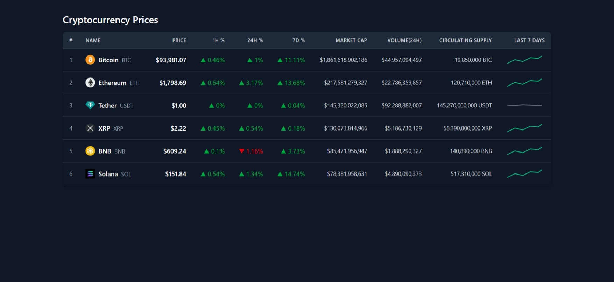

# Crypto Price Tracker - React & Redux Toolkit

A responsive web application displaying simulated real-time cryptocurrency prices, built using React, Redux Toolkit, and Tailwind CSS.

## Demo

[]

**[View Demo Video](public/crypto-tracker.demo-video.mp4)**

---

## Features

- **Real-time Simulation:** Prices, % changes, and volume update every 1.5s via simulated WebSocket using `setInterval`.
- **Filter & Sort:** Easily filter/sort by top gainers/losers, price, market cap, etc.
- **Data Display:** Displays rank, name, symbol, price, % changes (1h, 24h, 7d), market cap, volume, and supply.
- **Redux State Management:** Centralized store with Redux Toolkit (createSlice, selectors, configureStore).
- **Persistent State:** localStorage support keeps user settings and filters even after a refresh.
- **Responsive Design:** Table scrolls horizontally on smaller devices. Tailwind CSS ensures a clean and adaptable layout.
- **Visual Indicators:** Green for positive % change, red for negative. Static SVG 7D chart gives visual trends.
- **Modern Tooling:** Built with Vite for a fast dev experience.
- **Dark Mode Ready:** Basic dark mode styling with Tailwind.

---

## Technology Stack

- **Framework:** React 18+
- **State Management:** Redux Toolkit, React-Redux
- **Build Tool:** Vite
- **Styling:** Tailwind CSS v3
- **Extras:** localStorage API, JavaScript (ES6+), JSX

---

## Project Structure

```text
/public/
└── charts/                # Static SVG chart assets
    ├── generic-down-trend.svg
    ├── generic-flat-trend.svg
    └── generic-up-trend.svg
/src/
├── app/                   # Redux store configuration
│   └── store.js
├── components/            # Reusable UI components
│   ├── CryptoTable.jsx
│   ├── CryptoTableRow.jsx
│   └── FilterBar.jsx      # Filtering/sorting UI
├── data/
│   └── sampleData.js      # Initial static crypto data
├── features/
│   └── crypto/
│       └── cryptoSlice.js # Redux slice managing crypto state
├── utils/
│   └── localStorage.js    # Load/save state from localStorage
├── App.jsx                # Main component & real-time update logic
├── index.css              # Tailwind base styles
└── main.jsx               # Entry point + Redux Provider
README.md
vite.config.js
tailwind.config.js
package.json
```

---

## Getting Started

### Prerequisites

- Node.js (LTS recommended)
- npm or yarn

### Installation

Clone the repo:

```bash
git clone <YOUR_REPOSITORY_URL>
cd crypto-tracker
```

Install dependencies:

```bash
npm install
# or
yarn install
```

Run the dev server:

```bash
npm run dev
# or
yarn dev
```

Visit [http://localhost:5173](http://localhost:5173) to see the app.

---

## Bonus Features Implemented ✅

- ✅ **Filters & Sorting:** Sort by price, market cap, volume, % change; filter by top gainers, etc.
- ✅ **localStorage Support:** Persist filters/sort settings between sessions.

---

## How It Works

- A list of 5+ crypto assets is stored in Redux state.
- Every 1.5s, a random update is dispatched to simulate real-time price/volume changes.
- Filtering/sorting uses Redux selectors to ensure performance.
- User's last-used sort/filter settings are saved via `localStorage`.

---

## Notes

This app was built for an internship assignment to demonstrate:
- Practical use of Redux Toolkit
- Real-time UI simulation
- Clean architecture and responsive UI
- Bonus features like localStorage + sorting/filtering

---

## License

MIT – use it, remix it, own it.
